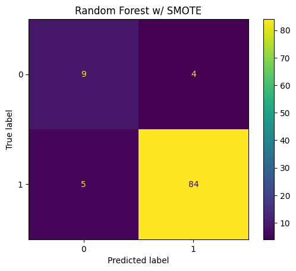
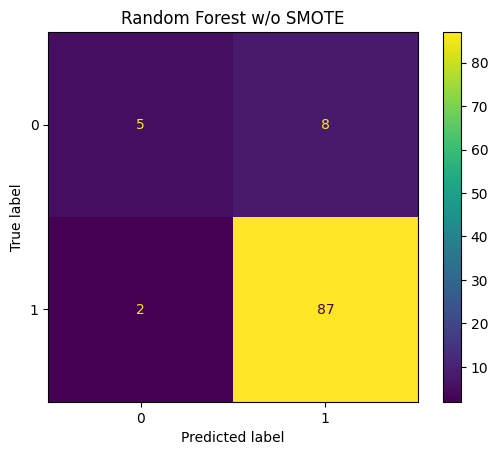
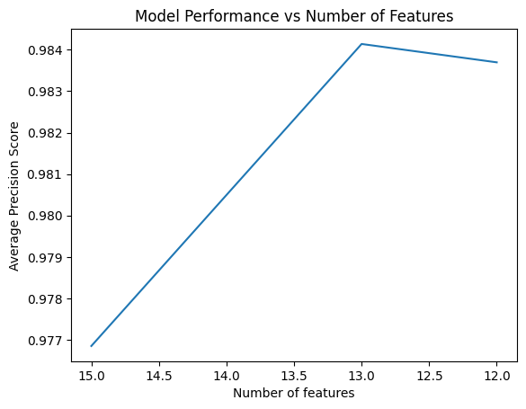
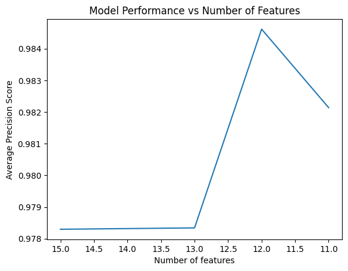

# Lung Cancer Prediction from Survey Data

## Overview
This project explores the prediction of lung cancer risk based on patient survey responses. The primary goals were to build an effective classification model from a dataset with a significant class imbalance and to identify survey questions that offer little predictive value. The methodology involves a comparative analysis between two modeling pipelines—one that uses the SMOTE oversampling technique and one that does not—to determine the most effective approach. The key outcome is a data-driven recommendation to shorten the survey based on the results of the superior model.

## Problem Statement
Patient surveys are a valuable tool for data collection, but lengthy or poorly designed surveys can lead to "survey fatigue," resulting in incomplete or inaccurate responses. This project tackles two key problems:
1. Which modeling strategy yields a better predictive model when dealing with a significant class imbalance in the dataset?
2. Can we use the resulting model to identify and remove non-essential questions, thereby streamlining the survey for future patients?

## Dataset
* **Source:** https://www.kaggle.com/datasets/aagambshah/lung-cancer-dataset
* **Features:** The dataset consists of 15 survey questions (features) related to patient demographics, lifestyle, and symptoms.
* **Target:** The binary target variable is `LUNG_CANCER` (YES/NO).
* **Challenge:** The dataset is highly imbalanced, with an unequal distribution between the positive and negative classes, which can bias standard classification algorithms.

## Methodology
To determine the best approach, a comparative analysis was conducted between two distinct modeling pipelines:

### Pipeline 1: Modeling with SMOTE
1. Data Splitting: The dataset was split into training, validation, and testing sets.
2. Oversampling: The Synthetic Minority Over-sampling Technique (SMOTE) was applied only to the training data to create a balanced set for model training.
3. Model Training & Feature Analysis: A `RandomForestClassifier` was trained on the balanced data. Permutation-based feature importance was then used to rank the predictive power of each survey question.
4. Iterative Feature Removal: Based on the feature importance rankings, questions that did not positively contribute to model prediction were systematically removed, and the model was retrained at each step to find the optimal feature set that maximized performance.

### Pipeline 2: Baseline Modeling (Without SMOTE)
1. Data Splitting: The same initial data split was used.
2. Model Training & Feature Analysis: A `RandomForestClassifier` was trained on the original, imbalanced training data. Permutation-based feature importance was performed.
3. Iterative Feature Removal: The same iterative feature removal process was followed to find the optimal feature set for the model trained on the imbalanced data.

Finally, the best-performing model from each pipeline were retrained on all non-test data and scored using the held-out test set to determine the superior overall strategy.

## Results & Analysis
### 1. Final Model Performance Comparison
The final tuned models from both pipelines were evaluated on the unseen test set. The results show the comparative effectiveness of each approach in handling the imbalanced data and predicting outcomes.

| Final Tuned Model (With SMOTE) | Final Tuned Model (Without SMOTE) |
| ------------------------------ | ---------------------------- |
|  |  |
| **Precision:** 0.9545 | **Precision:** 0.9158 |
| **Recall:**    0.9438 | **Recall:**    0.9775 |
| **F1-Score:**  0.9492 | **F1-Score:**  0.9457 |

### 2. Impact of Feature Removal on Model Scores
For both pipelines, iteratively removing the non-contributing features resulted in either a more accurate model or one that was about the same. The plots below show how model performance changed as features were removed in each pipeline.

### Performance Curve for SMOTE Pipeline

### Performance Curve for Baseline Pipeline

### Key Findings
* The pipeline utilizing the SMOTE technique ultimately produced a more robust model, with greater Precision (0.9545) and a slightly higher F1-Score (0.9492).
* For both pipelines, it was possible to remove at least 3 survey questions while maintaining or even slightly improving the final model's performance. These 3 common features were `GENDER`, `CHEST_PAIN`, and `SMOKING`. 
* The baseline model (no SMOTE) suggested that an additional feature did not contribute to model scoring: `AGE`. However, in the pipeline that incorporated SMOTE, `AGE` did positively improve model scoring.

## Conclusion & Recommendation
The comparative analysis demonstrates that using SMOTE to address class imbalance was the superior strategy for this particular problem. This was due to the model that used SMOTE having greater precision as well as a higher F1-Score, proving superiority in predicting both positive and negative classes. The model trained with using SMOTE may have had a higher True Positive Rate (the majority class), but the model lacked performance when it came to its True Negative Rate. This problem would shine when predicting classes for a set of survey responses where there was a majority of negative lung cancer cases.

Recommendation: Based on the findings from the more effective pipeline, it is recommended that the 3 identified non-essential questions be removed from the patient survey: `GENDER`, `CHEST_PAIN`, and `SMOKING`. This action could shorten the survey, reduce survey fatigue, and potentially improve the quality of responses for the remaining, more impactful questions.
